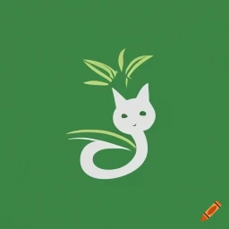

# Cat Tree

A *very* simple plain text representation of category hierarchies.

It should be human-readable and easily (de-)serializable.

The hierarchies are thought of as categories and sub-categories, organized in a tree-like structure.
Every node in the category tree is considered unique.

_(This is a toy project, spawned from another toy project,
intended to spawn the next toy project,
which is to be used in  the first toy project again.
So, yeah... make of that what you will.)_

## Examples

The end nodes in the following examples are technically not categories, but items within those categories.
Since they belong to exactly one category, we can treat them the same as unique category-nodes.

### Example 1

example-1.ctr

```
# This is a (non-exhaustive) category tree for language families
# Comments start with a '#', btw

Austro-Asiatic
	# Indentation (tabulator) opens a new sub-category
	Khmer
	Vietic
		Vietnamese
		Muong

# Empty lines are ignored

Austronesian
	Atalayic
		Atayal
		Seediq
	Malayo-Polynesian
		Indonesian
		Tagalog

Indo-European
	Germanic
		English
		German
	Indo-Aryan
		Hindi
		Kashmiri
	Slavic
		Czech
		Polish
		Russian
```

### Example 2

example-2.ctr

```
# Indentation doesn't have to be done with tabulators
# Any sequence is acceptable, but it should be consistant
# We'll use dashes here
# Spaces around category names will be ignored
# (That is, unless the single whitespace character itself is used for indentation...)

# Let's talk about egg dishes by region
Asia
- Balut
- Century Egg
- Japan
-- Datemaki
-- Tamago kake gohan
Europe
- Scotch egg
- France
-- Quiche
-- Soufflé
```

## Changelog

### 1.0

* initial publication

## Credits

* [Craiyon](https://www.craiyon.com/) for the Cat Tree Logo
